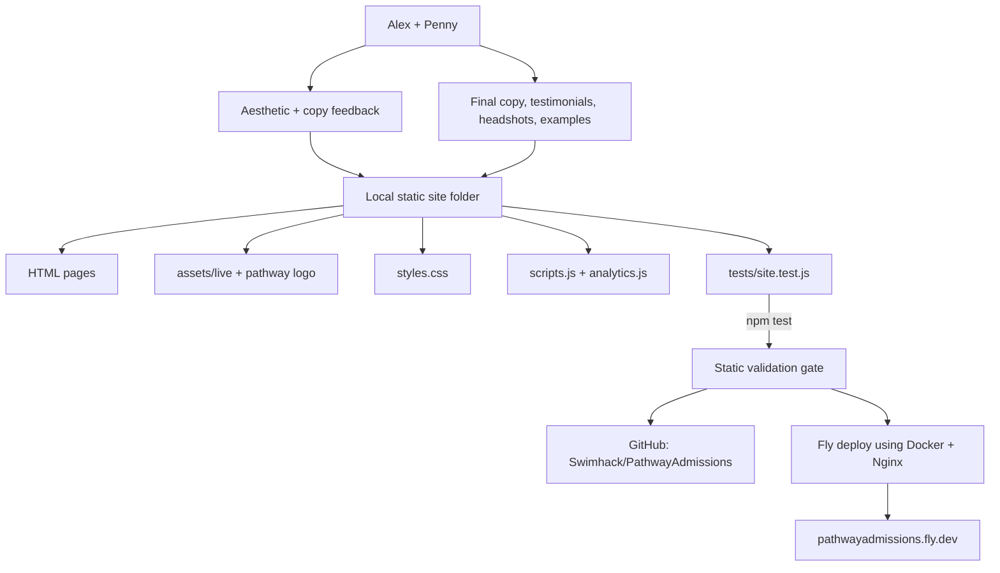
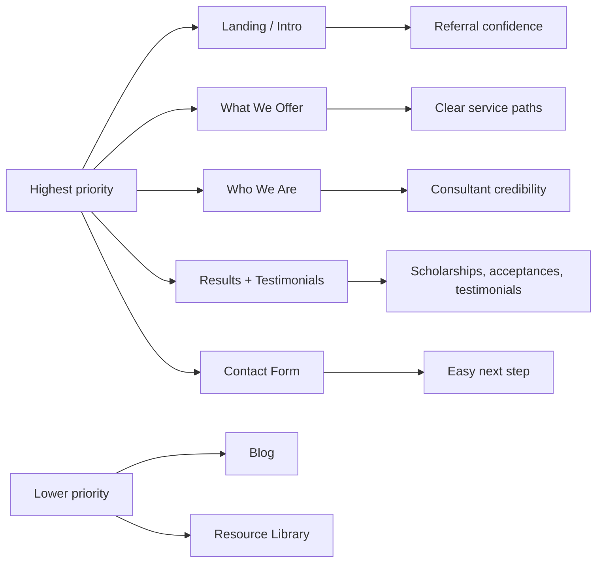

# Pathway Admissions Website Redesign Handoff

Last updated: May 5, 2026

This document is the complete handoff for the Pathway Admissions website redesign project. It is written so another agent can continue without needing the original chat history.

## Executive Summary

Pathway Admissions has paid the initial $2,000 deposit on a $4,000 website redesign project. The working goal is not a rebrand. The client wants a sleeker, stronger, more current, and more professional replacement for the existing Weebly site while preserving the Pathway logo, color identity, and much of the existing wording.

A static HTML/CSS/JS redesign has been built, tested, pushed to GitHub, and deployed to Fly.io:

- Live proof: `https://pathwayadmissions.fly.dev/`
- GitHub repo: `https://github.com/Swimhack/PathwayAdmissions`
- Local project: `C:\STRICKLAND\Strickland Technology Marketing\pathwayadmissions.com`

The current proof is intentionally a foundation, not final client-approved design. The next agent should focus on client alignment, Penny’s aesthetic feedback, updated copy/headshots/testimonials, and content refinement.

## Client And Stakeholder Context

Primary client stakeholders:

- Alexandra Wax: `alexandra@pathwayadmissions.com`
- Penny Linsenmayer: `penny@pathwayadmissions.com`
- James Strickland: vendor/developer, Strickland Technology

Relationship:

- James and Alex have known each other for 20+ years.
- Alex is comfortable working directly with James.
- Penny wants to be included and has strong opinions about aesthetics and web design.
- Penny should be included on all emails going forward.

Budget:

- Total agreed project investment: `$4,000`
- Payment structure: two payments of `$2,000`
- Initial `$2,000` deposit received.
- Remaining `$2,000` due upon completion/final launch or handoff.

Original proposal direction:

- Rebuild current Weebly site on a more modern, manageable platform.
- Improve design, structure, professionalism, basic SEO, contact form, analytics/Search Console.
- Original one-pager positioned SEO/lead generation more strongly, but the client clarified they are mostly referral-driven.

Updated positioning:

- The site is primarily a referral validation and credibility tool, not an aggressive organic lead generation machine.
- It should make referred families feel confident quickly.
- It should present Pathway as the premium consultancy it already is.

## Critical Recent Email Context

Most important client update from Alex:

> In terms of core pages rebuilt first:
> - landing page/intro page
> - What We Offer
> - Who We Are
> - Our Results (including the testimonials)
> - Contact Form
>
> all the blog and resource stuff is much, much lower priority.
> I can put together updated testimonials and copy for you (and I think some of us have new headshots). I want to update my bio and will check with others about theirs as well before our meeting next week.

Most important client update from Penny:

> I'd love to be included on all emails going forward just so I can stay up to date with what we're doing. I actually have fairly (uncharacteristically) strong opinions about aesthetics and web design, so I do want to be involved!
>
> I saw the email on Wednesday but hadn't yet had time to reply. I wonder if it would make sense for me to find some examples of websites in our industry that I love. I'm not sure if you wanted approval for a color scheme yet or which part of what you sent on Wednesday you're seeking feedback on -- can you clarify? I don't want to change our logo and color scheme -- or at least that wasn't really in my thought process. I'd like the website to be functionally sleeker, stronger, more up-to-date, and more professional than what we could achieve with Weebly. But a lot of our verbiage is likely worth retaining in some way.

Alex then replied:

> Yes! Sorry you werent CC’d. I think James and I are going to catch up over coffee, but I want you to take charge of aesthetics here!

Implications:

- Include Penny on everything going forward.
- Do not propose changing logo or color direction unless the client explicitly asks.
- Ask Penny for 2-3 industry examples she likes and what she likes about them.
- Treat current proof as directional, not final.
- Keep useful existing verbiage and reorganize it rather than rewriting everything.
- Blog/resource migration is lower priority than core pages.

## Suggested Client Reply Already Drafted

If another agent needs to reply to Penny/Alex, use this as the base:

```text
Hi Penny and Alex,

Absolutely, Penny — I’ll make sure you’re included on all emails going forward.

That clarification is very helpful, and it lines up well with the direction I’ve been working toward. I’m not trying to change the Pathway identity, logo, or overall color scheme. The proof I put together is meant to show how we can keep the existing brand and much of the useful verbiage, but present it in a cleaner, more current, more professional way than Weebly allows.

At this stage, I’d treat the proof as a starting point for direction rather than a finished design. The main things I’d love feedback on are whether the structure, navigation, overall feel, and page priorities are moving in the right direction. From there, we can refine the aesthetics, copy, photos, testimonials, and specific wording.

If you have 2–3 examples of websites in your industry that you like, that would still be very helpful — especially if you can point out what you like about them: layout, typography, tone, imagery, navigation, or just the overall feel.

And yes, Alex and I had discussed catching up next week. I’m happy to include both of you in that conversation so we can align on aesthetics and priorities together.

Warmly,
James
```

## Current Site State

The current proof is a static site using:

- HTML
- CSS
- Vanilla JavaScript
- Nginx container for Fly.io deployment
- Node-based dependency-free tests

Core full pages:

- `index.html` - homepage / landing / intro page
- `college-admissions.html` - college admissions advising
- `middle-high-school-admissions.html` - middle/high school admissions
- `careers-majors.html` - careers and majors assessments
- `test-preparation.html` - test prep
- `results.html` - outcomes/results, including local acceptances PDF
- `team.html` - who we are / team
- `testimonials.html` - testimonials structure
- `contact.html` - contact/inquiry form

Legacy redirect pages:

- `middlehigh-school-admissions.html` -> `middle-high-school-admissions.html`
- `careers--majors-packages.html` -> `careers-majors.html`
- `who-we-are.html` -> `team.html`
- `our-results.html` -> `results.html`
- `alexandra-wax.html` -> `team.html`
- `penny-linsenmayer.html` -> `team.html`
- `ourservices.html` -> `college-admissions.html`
- `new-page.html` -> `careers-majors.html`

Important support files:

- `styles.css` - main styling, Pathway colors, Eduguard-inspired layout
- `scripts.js` - mobile nav, keyboard closing, contact form guard/status
- `analytics.js` - safe-by-default GA4 loader; only active if `window.PA_GA4_ID` is set
- `sitemap.xml`
- `robots.txt`
- `.htaccess` - Apache-style legacy redirects
- `nginx.conf` - Fly/Nginx production serving config and redirects
- `Dockerfile`
- `fly.toml`
- `.dockerignore`
- `.gitignore`
- `package.json`
- `tests/site.test.js`

## Visual Direction

Template reference:

- User requested the GitHub template `templatecookie/eduguard-html`.
- The template was reviewed and adapted as design inspiration.
- The full Eduguard LMS/cart/sign-in scaffolding was not imported because it would overcomplicate scope and introduce irrelevant UI.

Current design approach:

- Bright education/professional services look.
- White cards/surfaces.
- Soft blue sections.
- Rounded cards.
- Strong CTA pills.
- Prominent Pathway logo.
- Colors adapted from Pathway identity: navy, blue, green/teal, gold accents.

Important client aesthetic constraint:

- Penny explicitly does not want to change the logo or color scheme.
- The next iteration should refine within existing brand identity.

## Assets

Live assets were scraped/downloaded into:

- `assets/live/`

Primary logo:

- `assets/pathway-logo.png`

Named person images currently used:

- Alexandra Wax: `assets/live/Alex_Wax_2.jpeg`
- Penny Linsenmayer: `assets/live/penny-linsenmayer-square_orig.jpeg`
- Nick Accrocco: `assets/live/nja-new-headshot_orig.png`
- Tracy Knight: `assets/live/Tracy Knight.jpg`
- Alex Peterson: `assets/live/ALEX_ PETERSON.jpeg`
- Abigail Myers: `assets/live/ABIGAIL_MYERS.jpg`
- Devanshi Patel: `assets/live/Devanshi Patel.jpg`

Other important assets:

- Founder/homepage image: `assets/live/updated-alex-and-penny.png`
- Guidance graphic: `assets/live/what-we-do.png`
- Acceptances PDF: `assets/live/2025_acceptances_-_pathway_admissions.pdf`
- Testimonial graphic: `assets/live/newmantestimonial.png`
- IECA/NACAC/TACAC logos in `assets/live/`
- Birkman/Strong logos in `assets/live/`
- Asset manifest: `assets/live/manifest.json`

Important correction already made:

- `headshot-2016.jpg` is not Alex Wax and should not be used for Alex.
- Alex Wax should use `Alex_Wax_2.jpeg`.

## Deployment State

GitHub:

- Repo: `https://github.com/Swimhack/PathwayAdmissions`
- `main` branch was pushed successfully.
- Initial commit: `Initial Pathway Admissions website redesign`
- After GitHub push, Fly deployment files were added locally but not yet committed/pushed to GitHub.

Current local git status at time of handoff:

```text
## main...origin/main
?? .dockerignore
?? Dockerfile
?? fly.toml
?? nginx.conf
?? pathwayadmissions-home-1920x1080.jpg
?? PATHWAY_HANDOFF.md
```

Fly.io:

- Live URL: `https://pathwayadmissions.fly.dev/`
- Fly app name: `pathwayadmissions`
- Fly org used: `marks-stech`
- Region: `dfw`
- Deployed successfully on Apr 29, 2026.
- Smoke checks passed after deploy for homepage and `team.html`.

Fly org note:

- Attempt to create under personal org failed due overdue Fly billing.
- App was successfully created/deployed under `marks-stech`.

Current Fly CLI note:

- A later `fly status --app pathwayadmissions` failed with:

```text
Error: no access token available. Please login with 'flyctl auth login'
```

So the live site exists, but the next agent may need to re-authenticate Fly CLI before further deploys.

Screenshot:

- `pathwayadmissions-home-1920x1080.jpg`
- Saved locally at `C:\STRICKLAND\Strickland Technology Marketing\pathwayadmissions.com\pathwayadmissions-home-1920x1080.jpg`
- Verified dimensions: `1920 x 1080`

## Privacy And Commit Rules

Private/business docs exist locally but should not be deployed or committed:

- `contract_pathwayadmissions.docx`
- `contract_pathwayadmissions.pdf`
- `invoice_PA_04292026.doc`
- `invoice_PA_04292026.pdf`
- `pathway_admissions_one_pager.pdf`

They are listed in `.gitignore` and `.dockerignore`.

Do not commit private contracts, invoices, or proposal PDFs unless James explicitly requests it.

## Current Tests

Run:

```powershell
npm test
```

Latest test result:

```text
PASS full pages include production head metadata
PASS full pages include shared navigation, CSS, and scripts
PASS local links and assets resolve
PASS CSS asset URLs resolve
PASS mobile navigation script supports production interactions
PASS legacy redirect pages are noindex and point to canonical replacements
PASS contact form has required production fields and guarded validation
PASS team page uses named person assets
PASS core production files exist

9 full pages and 8 redirects checked.
```

Test coverage:

- Production head metadata
- Shared navigation
- CSS/script inclusion
- Local links/assets
- CSS asset references
- Mobile nav behavior markers
- Legacy redirects
- Contact form required fields
- Named person assets
- Core files

Known limitation:

- These are static validation tests, not browser visual regression tests.
- There is no Playwright test suite committed.

## Known Gaps / Not Production-Final

1. Blog not migrated.

Existing blog is live at:

- `https://pathwayadmissions.com/blog.html`

Important context:

- Alex said blog/resource stuff is “much, much lower priority.”
- Do not prioritize blog before core pages unless the client asks.

2. Contact form is not wired to a live endpoint.

Current behavior:

- The form validates required fields.
- If `action="#"`, it shows a status message saying it is ready to connect to email/CRM.

Needed before final launch:

- Decide destination: email, CRM, form service, or backend endpoint.
- Add spam protection if public.

3. GA4 is not active.

Current behavior:

- `analytics.js` only loads GA4 if `window.PA_GA4_ID` is defined before `analytics.js`.

Needed:

- Get GA4 measurement ID.
- Add it to pages before `analytics.js`, or refactor into a small config file.

4. Search Console not configured.

Needed:

- Domain/property access.
- Submit `sitemap.xml` after launch.

5. Copy is not final.

Current copy is a polished structural draft using existing site language.

Needed:

- Alex will provide updated testimonials, copy, headshots, and bio edits.
- Penny likely wants to preserve much of the current verbiage.

6. Aesthetics not final.

Current proof is directionally aligned but Penny wants aesthetic involvement.

Needed:

- Ask Penny for 2-3 industry sites she likes.
- Ask what specifically she likes: layout, typography, imagery, navigation, tone, spacing, etc.
- Iterate after feedback.

7. Local deploy files not committed.

Current uncommitted deploy files:

- `.dockerignore`
- `Dockerfile`
- `fly.toml`
- `nginx.conf`

Recommendation:

- Commit these after the user approves retaining Fly deployment config in the GitHub repo.

## Architecture / Flow Graph



## Page Priority Graph



## Current URL Map

```mermaid
flowchart TD
  Root["/"] --> Home["index.html"]
  Root --> College["college-admissions.html"]
  Root --> MiddleHigh["middle-high-school-admissions.html"]
  Root --> Careers["careers-majors.html"]
  Root --> TestPrep["test-preparation.html"]
  Root --> Results["results.html"]
  Root --> Team["team.html"]
  Root --> Testimonials["testimonials.html"]
  Root --> Contact["contact.html"]

  OldMiddle["middlehigh-school-admissions.html"] --> MiddleHigh
  OldCareers["careers--majors-packages.html"] --> Careers
  OldWho["who-we-are.html"] --> Team
  OldResults["our-results.html"] --> Results
  OldAlex["alexandra-wax.html"] --> Team
  OldPenny["penny-linsenmayer.html"] --> Team
  OldServices["ourservices.html"] --> College
  OldNew["new-page.html"] --> Careers
```



## Recommended Next Agent Steps

1. Confirm with James whether to commit/push the Fly deployment files and the screenshot.

If approved:

```powershell
git add .dockerignore Dockerfile fly.toml nginx.conf pathwayadmissions-home-1920x1080.jpg PATHWAY_HANDOFF.md
git commit -m "Add Fly deployment configuration and handoff"
git push
```

2. Send or refine the Penny/Alex reply.

Make sure:

- Penny is included.
- State that current proof preserves brand/logo/color direction.
- Ask for 2-3 example sites Penny likes.
- Clarify that proof is directional and not final.

3. Wait for client assets/copy.

Expected from Alex:

- Updated testimonials
- Updated copy
- Updated headshots
- Updated bios

Expected from Penny:

- Aesthetic examples and preferences
- Feedback on structure/navigation/visual direction

4. Update core pages before touching blog.

Priority order:

- `index.html`
- `college-admissions.html` / service pages, possibly consolidate into “What We Offer”
- `team.html`
- `results.html`
- `testimonials.html`
- `contact.html`

5. Wire contact form.

Choose one:

- Simple form provider
- Email endpoint
- CRM
- Custom backend

6. Add analytics/Search Console.

Needed from client:

- GA4 measurement ID or permission to create
- Google Search Console/domain verification access

7. Deploy again.

Before deployment:

```powershell
npm test
```

If Fly CLI requires auth:

```powershell
fly auth login
fly deploy --remote-only
```

8. Smoke-check:

- `https://pathwayadmissions.fly.dev/`
- `https://pathwayadmissions.fly.dev/team.html`
- `https://pathwayadmissions.fly.dev/contact.html`
- Legacy redirect URLs

## Do Not Forget

- Penny must be CC’d/included going forward.
- Do not frame this as “changing the brand.”
- Do not overbuild the blog/resource library yet.
- Do not commit private contract/invoice/proposal docs.
- The client bought a $4K focused rebuild, not a full marketing automation platform.
- Current proof is useful but needs client aesthetic feedback before final polish.

